# MVP RPA de Cotações OPME

## Sumário Executivo

Este documento descreve o MVP (Minimum Viable Product) do módulo de automação de cotações (Cotação RPA) para distribuidores de OPME. O sistema automatiza a coleta de cotações em portais de operadoras e plataformas de saúde, centralizando as informações em um painel unificado com integração ao ERP.

## Objetivos do MVP

### Critérios de Sucesso (MVP "passa" se cumprir)

1. **Operação estável em 2 portais/plataformas** com alta robustez
2. **Captura de campos essenciais** (ID, deadline, itens, quantidades) com trilha de auditoria
3. **Revisão humana** antes de envio, reduzindo risco operacional

### Métricas de Sucesso

| Métrica | Meta MVP | Descrição |
|---------|----------|-----------|
| TPR (True Positive Rate) | ≥ 90% | Cotações relevantes capturadas / total disponíveis |
| Precisão de captura | ≥ 95% | Campos essenciais corretamente preenchidos |
| Tempo por cotação | ≤ 5 min (P95) | Tempo do job até persistência canônica |
| Taxa de sucesso do bot | ≥ 85% | Runs com sucesso / total de runs |
| Disponibilidade | ≥ 95% | Uptime do sistema em horário comercial |

## Arquitetura

### Visão Geral

```
┌─────────────────┐     ┌─────────────────┐     ┌─────────────────┐
│   Scheduler/    │────▶│   Fila de       │────▶│   Bot Workers   │
│   Orquestrador  │     │   Jobs          │     │   (Playwright)  │
└─────────────────┘     └─────────────────┘     └────────┬────────┘
                                                         │
                                                         ▼
┌─────────────────┐     ┌─────────────────┐     ┌─────────────────┐
│   Dashboard/    │◀────│   API de        │◀────│   Normalização  │
│   Frontend      │     │   Ingestão      │     │   & Persistência│
└─────────────────┘     └─────────────────┘     └─────────────────┘
                                │
                                ▼
                        ┌─────────────────┐
                        │   Webhook/      │
                        │   ERP           │
                        └─────────────────┘
```

### Componentes

| Componente | Responsabilidade | Tecnologia |
|------------|------------------|------------|
| Orquestrador | Agenda, distribui jobs, controla concorrência | Python + asyncio |
| Bot Workers | Login/navegação/captura/download | Playwright |
| API de Ingestão | Recebe resultados, valida, persiste | FastAPI |
| Normalizador | Mapeia campos do portal → esquema canônico | Python |
| Banco de Dados | Armazena cotações, itens, anexos, execuções | PostgreSQL |
| Fila | Jobs de coleta e processamento | Redis (opcional) |
| Observabilidade | Logs, métricas, alertas | Logging estruturado |

### Fluxo de Dados

```mermaid
flowchart LR
    A[Scheduler] --> B[Fila de Jobs]
    B --> C[Bot Worker]
    C --> D[Login no Portal]
    D --> E[Navegação & Filtros]
    E --> F[Lista de Cotações]
    F --> G[Captura Detalhes]
    G --> H[Download Anexos]
    H --> I[POST API Ingestão]
    I --> J[Persistência DB]
    J --> K[Normalização]
    K --> L[Dashboard/API]
    L --> M[Webhook ERP]
```



## Modelo de Dados

### Entidades Principais

#### Quote (Cotação)

| Campo | Tipo | Descrição |
|-------|------|-----------|
| id | UUID | Identificador único |
| tenant_id | String | ID do tenant/cliente |
| portal | String | Nome do portal de origem |
| external_id | String | ID no portal (chave idempotente) |
| status | Enum | open, pending, draft, sent, won, lost, expired, closed |
| buyer_name | String | Nome do comprador |
| buyer_type | Enum | operator, hospital, clinic, platform |
| deadline | DateTime | Prazo para resposta |
| delivery_city/state | String | Local de entrega |

#### QuoteItem (Item de Cotação)

| Campo | Tipo | Descrição |
|-------|------|-----------|
| quote_id | UUID | Referência à cotação |
| line_no | String | Número da linha |
| product_code_raw | String | Código do produto (bruto) |
| product_name_raw | String | Nome do produto (bruto) |
| normalized_sku | String | SKU normalizado |
| qty | String | Quantidade |
| uom | String | Unidade de medida |
| brand_pref | String | Marca preferencial |

#### RpaRun (Execução RPA)

| Campo | Tipo | Descrição |
|-------|------|-----------|
| portal_name | String | Portal executado |
| status | Enum | queued, running, success, partial, failed |
| quotes_found | Integer | Cotações encontradas |
| captcha_encountered | Boolean | CAPTCHA detectado |
| login_failed | Boolean | Falha no login |
| duration_seconds | Integer | Duração da execução |

## APIs

### Ingestão de Cotações (RPA → API)

```bash
POST /api/quotes/ingest
Authorization: Bearer {INGEST_API_KEY}
Content-Type: application/json

{
  "quotes": [
    {
      "tenant_id": "tnt_001",
      "portal": "portal_x",
      "external_id": "Q-983746",
      "status": "open",
      "deadline": "2026-02-26T18:00:00-03:00",
      "buyer": {
        "name": "Hospital Exemplo",
        "type": "hospital"
      },
      "delivery": {
        "city": "São Paulo",
        "state": "SP"
      },
      "items": [
        {
          "line_no": "1",
          "product_code_raw": "OPME-123",
          "product_name_raw": "Placa bloqueada 3.5mm",
          "qty": "2",
          "uom": "un"
        }
      ],
      "attachments": [
        {
          "filename": "termo_referencia.pdf",
          "storage_uri": "s3://bucket/.../termo.pdf",
          "sha256": "..."
        }
      ]
    }
  ]
}
```

### Webhook ERP

```bash
POST /api/quotes/webhook/erp
Authorization: Bearer {INGEST_API_KEY}

{
  "event": "quotation.synced",
  "quotation_id": "uuid-da-cotacao"
}
```

Eventos suportados:
- `quotation.synced`: ERP sincronizou cotação
- `quotation.won`: Cotação ganha
- `quotation.lost`: Cotação perdida

### Exportação CSV

```bash
GET /api/quotes/export/csv?portal=demo&status=open
Authorization: Bearer {JWT_TOKEN}
```

## Framework RPA

### Estrutura de Arquivos

```
services/rpa/
├── collect_quotes.py      # Ponto de entrada CLI/Worker
├── core/
│   ├── base_bot.py        # Classe base para bots
│   ├── circuit_breaker.py # Proteção contra falhas
│   ├── config.py          # Configurações
│   ├── metrics.py         # Observabilidade
│   ├── orchestrator.py    # Orquestrador de jobs
│   └── retry.py           # Mecanismo de retry
└── portals/
    ├── demo_portal.py     # Bot de demonstração
    └── generic_portal.py  # Bot genérico configurável
```

### Implementando um Novo Portal

```python
from core.base_bot import BaseBot, CapturedQuote, JobConfig
from core.config import PortalConfig

class MeuPortalBot(BaseBot):
    def __init__(self):
        config = PortalConfig(
            name="meu_portal",
            display_name="Meu Portal",
            base_url="https://meuportal.com.br",
            login_url="https://meuportal.com.br/login",
            list_url="https://meuportal.com.br/cotacoes",
        )
        super().__init__(config)
    
    async def login(self, job: JobConfig) -> bool:
        # Implementar login específico
        await self._page.goto(self.portal_config.login_url)
        await self._page.fill("#email", username)
        await self._page.fill("#password", password)
        await self._page.click("button[type=submit]")
        return True
    
    async def navigate_to_list(self, job: JobConfig):
        # Navegar até listagem
        await self._page.goto(self.portal_config.list_url)
    
    async def get_quote_list(self, job: JobConfig) -> list:
        # Extrair lista de cotações
        return await self._page.query_selector_all(".quote-row")
    
    async def capture_quote_detail(self, quote_ref, job: JobConfig) -> CapturedQuote:
        # Capturar detalhes de uma cotação
        await quote_ref.click()
        # ... extrair dados
        return CapturedQuote(
            external_id="...",
            portal=self.portal_name,
            items=[...],
        )
```

### Circuit Breaker

O sistema implementa circuit breaker por portal para evitar banimento:

- **CLOSED**: Operação normal
- **OPEN**: Bloqueado após 5 falhas consecutivas (aguarda 60s)
- **HALF_OPEN**: Testando recuperação

```python
from core.circuit_breaker import CircuitBreakerRegistry

# Obtém status de todos os circuit breakers
status = CircuitBreakerRegistry.get_all_status()

# Reset manual
CircuitBreakerRegistry.reset("portal_x")
```

### Retry com Backoff

```python
from core.retry import RetryConfig, retry_async

config = RetryConfig(
    max_attempts=3,
    backoff_seconds=[10, 60, 300],  # 10s, 1min, 5min
    jitter=True,  # Variação aleatória
)

result = await retry_async(minha_funcao, config, arg1, arg2)
```

## Runbooks

### Execução Manual (CLI)

```bash
# Modo demo (gera dados fake)
cd services/rpa
python collect_quotes.py --portal demo --tenant tnt_001

# Portal real
export PORTAL_BIONEXO_USER=usuario
export PORTAL_BIONEXO_PASSWORD=senha
python collect_quotes.py --portal bionexo --tenant tnt_001 --max-quotes 20

# Saída JSON
python collect_quotes.py --portal demo --output json
```

### Execução em Modo Worker

```bash
# Inicia 3 workers processando fila
python collect_quotes.py --worker --workers 3
```

### Variáveis de Ambiente

| Variável | Descrição | Default |
|----------|-----------|---------|
| OPME_API_URL | URL da API | http://localhost:8000 |
| OPME_API_TOKEN | Token de autenticação | - |
| RPA_STORAGE_PATH | Caminho para armazenamento | /tmp/rpa_storage |
| RPA_SCREENSHOTS | Habilitar screenshots | true |
| RPA_HEADLESS | Modo headless | true |
| RPA_MAX_CONCURRENT | Jobs simultâneos | 3 |
| RPA_LOG_LEVEL | Nível de log | INFO |
| PORTAL_{NAME}_USER | Usuário do portal | - |
| PORTAL_{NAME}_PASSWORD | Senha do portal | - |

### Troubleshooting

#### Bot não consegue fazer login

1. Verificar credenciais nas variáveis de ambiente
2. Verificar se o portal está acessível
3. Verificar screenshots em `RPA_STORAGE_PATH/screenshots/`
4. Verificar se há CAPTCHA (campo `captcha_encountered` no RpaRun)

#### Circuit breaker aberto

1. Verificar logs de erro do portal
2. Aguardar timeout (60s) ou fazer reset manual
3. Verificar se o portal não bloqueou o IP

#### Cotações duplicadas

O sistema usa `portal + external_id` como chave de idempotência. Se uma cotação já existe, ela é atualizada em vez de duplicada.

## Testes

### Testes de Automação

```bash
# Teste do bot demo
python collect_quotes.py --portal demo --output json

# Verificar métricas
curl -H "Authorization: Bearer $TOKEN" http://localhost:8000/api/quotes/rpa/stats
```

### Testes de Integração

```bash
# Ingestão de cotação
curl -X POST http://localhost:8000/api/quotes/ingest \
  -H "Authorization: Bearer $INGEST_API_KEY" \
  -H "Content-Type: application/json" \
  -d '{"quotes": [{"portal": "test", "external_id": "TEST-001", "status": "open"}]}'

# Listagem
curl -H "Authorization: Bearer $TOKEN" http://localhost:8000/api/quotes

# Exportação CSV
curl -H "Authorization: Bearer $TOKEN" http://localhost:8000/api/quotes/export/csv
```

## Riscos e Mitigações

### Termos de Uso / Antibot

| Risco | Mitigação |
|-------|-----------|
| Portais proíbem automação | Obter autorização contratual |
| Bloqueio por IP/user-agent | Rate limiting, IPs rotativos |
| Mudança de layout | Monitoramento, alertas, seletores resilientes |

### CAPTCHA / 2FA

| Cenário | Estratégia MVP |
|---------|----------------|
| CAPTCHA esporádico | Human-in-the-loop (fila de aprovação) |
| 2FA obrigatório | Modo "operador aprova" |
| CAPTCHA frequente | Priorizar outros portais |

### Proteção de Dados

- Credenciais armazenadas em secrets manager (não no código)
- Logs não contêm senhas ou dados sensíveis
- Segregação de acesso por tenant

## Cronograma MVP (3-6 meses)

### Fase 1: Preparação (Semanas 1-3)
- Levantamento de portais prioritários
- Definição de esquema canônico
- Setup de infraestrutura

### Fase 2: Portal 1 (Semanas 4-8)
- Implementação do bot
- Testes de captura
- Dashboard mínimo

### Fase 3: Portal 2 (Semanas 9-14)
- Implementação com anti-bot
- Regressão diária
- Hardening

### Fase 4: Integração e Piloto (Semanas 15-20)
- Webhook ERP
- Piloto com 2-4 clientes
- Métricas de sucesso

## Referências

- [Playwright Documentation](https://playwright.dev/python/)
- [FastAPI Documentation](https://fastapi.tiangolo.com/)
- [Circuit Breaker Pattern](https://martinfowler.com/bliki/CircuitBreaker.html)
